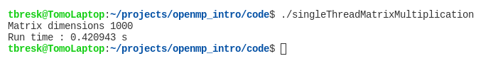
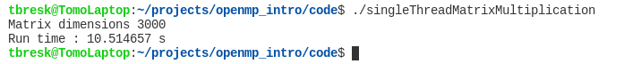
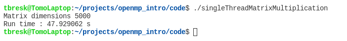
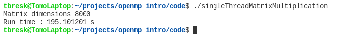
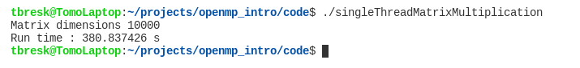
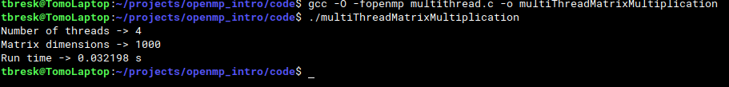
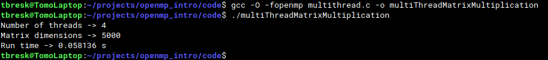
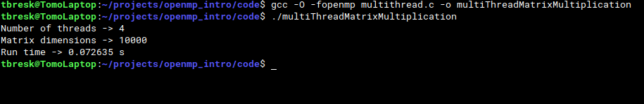

# Matrix multiplication with OpenMP

## Hardware specification

")

---

## Single thread matrix multiplication

---

CPU @ 1.7 gHz = 1 700 000 000 instructions per second (IPS)

Matrix multiplication algorithm number of instructions = n * n * n 

```
// C program for single thread matrix multiplication
# include <stdio.h>
# include <stdlib.h>
# include <limits.h>
# include <time.h>

# define MAT_DIM 10000

int main () {
	// Variables
	unsigned short mat[MAT_DIM][MAT_DIM], res[MAT_DIM][MAT_DIM], i, j, k;
	
	// Clock
	clock_t start, end;
    double cpu_time_used;
	
	// Starting clock
	start = clock();

	//Generate random matrix
	srand(time(0));
	for ( i = 0; i < MAT_DIM; i++ ) 
		for ( j = 0; j < MAT_DIM; j++ )
		{	
			res[i][j] = 0;
			mat[i][j] = rand() % USHRT_MAX;
		}
	
	//Matrix multiplication algorithm
	for ( i = 0; i < MAT_DIM; i++ ) 
		for ( j = 0; j < MAT_DIM; j++ )
			for ( k = 0; k < MAT_DIM; k++ )
				res[i][j] += mat[i][k] * mat[k][j];
	
	// Ending clock
	end = clock();
     	
	// Run time calculation
	cpu_time_used = ((double) (end - start)) / CLOCKS_PER_SEC;
	
	printf("Matrix dimensions %d\n", MAT_DIM);
	printf("Run time : %f s\n", cpu_time_used);

	return 0;
}
```

**n = 1000** 

> Average run-time = 1000 * 1000 * 1000 / 1 700 000 000 ~ 1 s. 



**n = 3000**

> Average run-time = 3000 * 3000 * 3000 / 1 700 000 000 ~ 16 s. 



**n = 5000**

> Average run-time = 5000 * 5000 * 5000 / 1 700 000 000 ~ 74 s. 
 


**n = 8000**

> Average run-time = 8000 * 8000 * 8000 / 1 700 000 000 ~ 301 s (5 min). 
 


**n = 10000**

> Average run-time = 10000 * 10000 * 10000 / 1 700 000 000 ~ 589 s (10 min). 
 


## Multithread matrix multiplication

---

CPU @ 1.7 gHz * 4 = 6 800 000 000 instructions per second (IPS)

Matrix multiplication algorithm number of instructions = n * n * n

```
// C program for multi thread matrix multiplication
# include <stdio.h>
# include <stdlib.h>
# include <limits.h>
# include <time.h>
# include <omp.h>

# define MAT_DIM 10000

// Shared variables
unsigned short mat[MAT_DIM][MAT_DIM], res[MAT_DIM][MAT_DIM];

int main () {
	// Variables
	unsigned short i, j, k; 

	// Setting number of threads
	// omp_set_num_threads(4);

	// Getting number of threads
	printf("Number of threads -> %d\n", omp_get_max_threads());
	
	// Clock
	clock_t start, end;
    double cpu_time_used;
	
	// Starting clock
	start = clock();

	srand(time(0));
	#pragma omp parallel 
	{
		//printf("Thread %d started\n", omp_get_thread_num());
		// Matrix initialization
		#pragma omp for collapse(2)
		for ( i = 0; i < MAT_DIM; i++ ) 
			for ( j = 0; j < MAT_DIM; j++ )
			{	
				res[i][j] = 0;
				mat[i][j] = rand() % USHRT_MAX;
			}
		
		// Matrix multiplication parallel
		#pragma omp for collapse(3)
		for ( i = 0; i < MAT_DIM; i++ )
			for ( j = 0; j < MAT_DIM; j++ )
				for( k = 0; k < MAT_DIM; k++)
					res[i][j] += mat[i][k] * mat[k][j];	
	}

	// Ending clock
	end = clock();
     	
	// Run time calculation
	cpu_time_used = ((double) (end - start)) / CLOCKS_PER_SEC;
	
	// Print result
	printf("Matrix dimensions -> %d\n", MAT_DIM);
	printf("Run time -> %f s\n", cpu_time_used);

	return 0;
}
```

**n = 1000** 

> Average run-time = 1000 * 1000 * 1000 / 6 800 000 000 ~ 0.14 s. 



**n = 5000**

> Average run-time = 5000 * 5000 * 5000 / 6 800 000 000 ~ 18 s. 
 


**n = 10000**

> Average run-time = 10000 * 10000 * 10000 / 1 700 000 000 ~ 147 s (2:30 min ). 
 


---